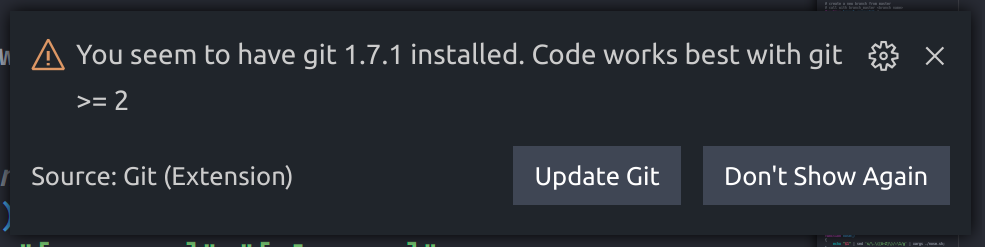
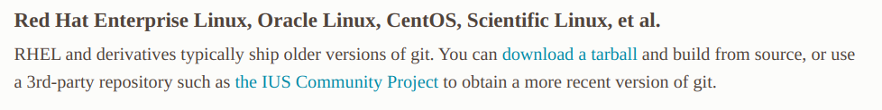

## Actualiza Git

### Disclaimer

- Para evitar posibles problemas en el paso a producción del sitio, recuerda mantener todos tus cambios en tu entorno local.

Si has decidido trabajar directamente desde nuestro contenedor en regress, lo primero que notarás será este alarmante aviso:



Este mensaje nos señala que para una experiencia de desarrollo optima (por ejemplo, ayudándonos con  __Git lens__) necesitamos la versión 2 o superior.

Lamentablemente, no existe una solución rapida para actualizar git a través de nuestro gestor de paquetes. El soporte de git a través de __yum__ (gestor de paquetes oficial de CentOS / RHEL) nos provee software compatible con la versión correspondiente del sistema operativo. Esto es coherente considerando que RHEL prioriza estabilidad por encima de nuevas funciones.

La solución a este problema, instalar manualmente GIT desde la fuente.

Entrando al sitio oficial de Git e ingresando al apartado de descargas para linux, veremos que cada sistema posee un amigable comando para instalar la ultima versión, excepto por nuestro buen CentOS...



> Acá indica que debemos instalar Git manualmente, y es lo que haremos!

Instala las herramientas de compilacion de centos

```bash
sudo yum groupinstall "Development Tools"
```
Este comando instalará inmediatamente las herramientas necesarias para transformar el codigo fuente de git en un ejecutable

Una vez instalada, debemos instalar dependencias que requiere Git

```bash
sudo yum install zlib-devel perl-ExtUtils-MakeMaker asciidoc xmlto openssl-devel
```